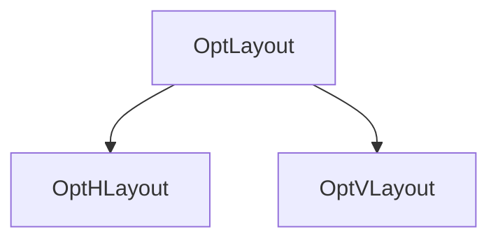

# UI Elements

All `OptUIElement` are simple wrapping of unity UI components. If you know what to do, you can use `OptUIElement.Base` to get the underlying component.

## OptUIElement

`OptUIElement` is the base class of all widgets.

### Properties

| Name            | Type             | Detail                                                                                                            |
| --------------- | ---------------- | ----------------------------------------------------------------------------------------------------------------- |
| PrefferedHeight | `int`            | Wrapper of `prefferedHeight` in `LayoutElement`.                                                                  |
| PrefferedWidth  | `int` or `float` | `int`: Wrapper of `prefferedWdith` in `LayoutElement`.<br>`float`: Wrapper of `flexibleWidth` in `LayoutElement`. |
| Enabled         | `bool`           | Whether the widget is enabled.                                                                                    |

## OptLayout



`OptLayout` is the base class of `OptHLayout` and `OptVLayout`. Wrapping "Add" methods for creating child widgets.

<details>
<summary>Methods</summary>

<br>

> [!WARNING]
> The `Add` method won't translate any text for you. You should call `ModOptionController.Tr` yourself to translate a translation ID.

```c#
OptLabel AddText(string text, TextAnchor align = TextAnchor.MiddleCenter, int size = 16, Color? color = null);
```

Add an `OptLabel` as a child to the layout.

| Name  | Type         | Detail                          |
| ----- | ------------ | ------------------------------- |
| text  | `string`     | The content for the `OptLabel`. |
| align | `TextAnchor` | The alignment method.           |
| size  | `int`        | The font size.                  |
| color | `Color?`     | The font color.                 |

```c#
OptTopic AddTopic(string text);
```

Add an `OptTopic` as a child to the layout.

| Name | Type     | Detail                          |
| ---- | -------- | ------------------------------- |
| text | `string` | The content for the `OptTopic`. |

```c#
OptButton AddButton(string text, string tooltip = null);
```

Add an `OptButton` as a child to the layout.

| Name    | Type     | Detail                           |
| ------- | -------- | -------------------------------- |
| text    | `string` | The content for the `OptButton`. |
| tooltip | `string` | The tooltip for the `OptButton`. |

```c#
OptToggle AddToggle(string text, bool isChecked = false, int size = 16, string tooltip = null);
```

Add an `OptToggle` as a child to the layout.

| Name      | Type     | Detail                              |
| --------- | -------- | ----------------------------------- |
| text      | `string` | The content for the `OptToggle`.    |
| isChecked | `bool`   | Whether the `OptToggle` is checked. |
| size      | `string` | The font size for the `OptToggle`.  |
| tooltip   | `string` | The tooltip for the `OptToggle`.    |

```c#
OptToggleGroup AddToggleGroup(string title = null, int min = 1, int max = 1, int size = 16, params (string, string, bool)[] items);
OptToggleGroup AddToggleGroup(string title = null, int min = 1, int max = 1, int size = 16, params string[] items);
```

Add an `OptToggleGroup` as a child to the layout.

| Name  | Type                                              | Detail                                          |
| ----- | ------------------------------------------------- | ----------------------------------------------- |
| title | `string`                                          | The title for the `OptToggleGroup`.             |
| min   | `int`                                             | The minimal selection for the `OptToggleGroup`. |
| max   | `int`                                             | The maximum selection for the `OptToggleGroup`. |
| size  | `string`                                          | The font size for each `OptToggle`.             |
| items | `(string text, string tooltip, bool isChecked)[]` | Data for each `OptToggle`.                      |
| items | `string[]`                                        | Text for each `OptToggle`.                      |

```c#
OptSlider AddSlider(string title, bool sideButtons = false, float min = 0, float max = 1, float value = 0);
```

Add an `OptSlider` as a child to the layout.

| Name        | Type     | Detail                                 |
| ----------- | -------- | -------------------------------------- |
| title       | `string` | The title for the `OptSlider`.         |
| sideButtons | `bool`   | Whether the `OptSlider` has buttons.   |
| min         | `float`  | The maximum value for the `OptSlider`. |
| max         | `float`  | The maximum value for the `OptSlider`. |
| value       | `float`  | Current value of the `OptSlider`.      |

```c#
OptDropdown AddDropdown(List<string> itemTexts, int current = 0);
OptDropdown AddDropdown(List<(string, string)> itemTextsAndTooltips, int current = 0);
```

Add an `OptDropdown` as a child to the layout.

| Name      | Type                                  | Detail                                   |
| --------- | ------------------------------------- | ---------------------------------------- |
| itemTexts | `List<string>`                        | Text for each item of the `OptDropdown`. |
| itemTexts | `List<(string text, string tooltip)>` | Data for each item of the `OptDropdown`. |
| current   | `int`                                 | Current item of the `OptDropdown`.       |

```c#
OptLRSelect AddLRSelect(List<string> itemTexts, int current = 0);
OptLRSelect AddLRSelect(List<(string, string)> itemTextsAndTooltips, int current = 0);
```

Add an `OptLRSelect` as a child to the layout.

| Name      | Type                                  | Detail                                   |
| --------- | ------------------------------------- | ---------------------------------------- |
| itemTexts | `List<string>`                        | Text for each item of the `OptLRSelect`. |
| itemTexts | `List<(string text, string tooltip)>` | Data for each item of the `OptLRSelect`. |
| current   | `int`                                 | Current item of the `OptLRSelect`.       |

```c#
OptInput AddInput(string value = null, string placeholder = null, int lengthLimit = 0, InputField.CharacterValidation validation = InputField.CharacterValidation.None);
```

Add an `OptInput` as a child to the layout.

| Name        | Type                             | Detail                                    |
| ----------- | -------------------------------- | ----------------------------------------- |
| value       | `string`                         | Current value of the `OptInput`.          |
| placeholder | `string`                         | Placeholder for the `OptInput`.           |
| lengthLimit | `int`                            | Character count limit for the `OptInput`. |
| validation  | `InputField.CharacterValidation` | Validation method for the `OptInput`.     |

```c#
OptHLayout AddHLayout(PixelOrPercentage? width = null);
```

Add an `OptHLayout` as a child to the layout.

| Name  | Type                       | Detail                                                                                                            |
| ----- | -------------------------- | ----------------------------------------------------------------------------------------------------------------- |
| width | `int` or `width` or `null` | `int`: Wrapper of `prefferedWdith` in `LayoutElement`.<br>`float`: Wrapper of `flexibleWidth` in `LayoutElement`. |

```c#
OptVLayout AddVLayout(int? height);
OptVLayout AddVLayoutWithBorder(string title, int? height = null);
```

Add an `OptVLayout` as a child to the layout.

| Name   | Type     | Detail                                      |
| ------ | -------- | ------------------------------------------- |
| height | `int?`   | The `prefferedHeight` of the `OptInput`.    |
| title  | `string` | The title for the `OptVLayout` with border. |

</details>

## OptHLayout

A layout in which its child elements are arranged horizontally and their width is managed by their parent.

| Base | `HorizontalLayoutGroup` |
| ---- | ----------------------- |

## OptVLayout

A layout in which its child elements are arranged vertically and their height grows depending on their parent.

| Base | `VerticalLayoutGroup` |
| ---- | --------------------- |

## OptLabel

Simply plain text.

| Base | `UIItem` |
| ---- | -------- |

### Properties

| Name  | Type         | Detail                          |
| ----- | ------------ | ------------------------------- |
| Text  | `string`     | The content for the `OptLabel`. |
| Align | `TextAnchor` | The alignment method.           |
| Size  | `int`        | The font size.                  |
| Color | `Color`      | The font color.                 |

## OptTopic

A special text that shows the configuration topic.

| Base | `UIItem` |
| ---- | -------- |

### Properties

| Name | Type     | Detail                          |
| ---- | -------- | ------------------------------- |
| Text | `string` | The content for the `OptTopic`. |

## OptToggle

An element with on/off status.

| Base | `UIButton` |
| ---- | ---------- |

### Events And Properties

| Name                   | Type           | Detail                              |
| ---------------------- | -------------- | ----------------------------------- |
| `event` OnValueChanged | `Action<bool>` | Fires when the status changed.      |
| Checked                | `bool`         | Whether the `OptToggle` is checked. |

## OptButton

An element that is clickable.

| Base | `UIButton` |
| ---- | ---------- |

### Events And Properties

| Name              | Type     | Detail                            |
| ----------------- | -------- | --------------------------------- |
| `event` OnClicked | `Action` | Fires when the button is clicked. |
| Text              | `string` | The content for the `OptButton`.  |

## OptSlider

An element that specifies a range.

| Base | `UISlider` |
| ---- | ---------- |

### Events And Properties

| Name                   | Type            | Detail                                 |
| ---------------------- | --------------- | -------------------------------------- |
| `event` OnValueChanged | `Action<float>` | Fires when the value changed.          |
| Title                  | `string`        | The title for the `OptSlider`.         |
| Min                    | `float`         | The maximum value for the `OptSlider`. |
| Max                    | `float`         | The maximum value for the `OptSlider`. |
| Value                  | `float`         | Current value of the `OptSlider`.      |
| `setter` Step          | `float`         | The amount changes on buttons clicked. |

## OptDropdown

An element that the player can choose one choice from multiple choices.

| Base | `UIDropdown` |
| ---- | ------------ |

### Events And Properties

| Name                   | Type          | Detail                                   |
| ---------------------- | ------------- | ---------------------------------------- |
| `event` OnValueChanged | `Action<int>` | Fires when the value changed.            |
| Value                  | `int`         | Current item index of the `OptDropdown`. |

## OptLRSelect

An element that the player can choose one choice from multiple choices.

| Base | `UIButtonLR` |
| ---- | ------------ |

### Events And Properties

| Name                   | Type          | Detail                                   |
| ---------------------- | ------------- | ---------------------------------------- |
| `event` OnValueChanged | `Action<int>` | Fires when the value changed.            |
| Value                  | `int`         | Current item index of the `OptLRSelect`. |

## OptInput

An element that the player can choose one choice from multiple choices.

| Base | `UIButtonLR` |
| ---- | ------------ |

### Events And Properties

| Name                    | Type                            | Detail                                                                                                  |
| ----------------------- | ------------------------------- | ------------------------------------------------------------------------------------------------------- |
| `event` OnValueChanged  | `Action<string>`                | Fires when the value changed.                                                                           |
| `event` OnChangingValue | `Func<string, int, char, char>` | Fires when the value changed.<br>`(string original, int index, char addedChar)`<br>`-> char addedChar ` |
| Text                    | `string`                        | Current value of the `OptInput`.                                                                        |
| Placeholder             | `string`                        | Placeholder for the `OptInput`.                                                                         |
| CharacterLimit          | `int`                           | Character count limit for the `OptInput`.                                                               |
| ContentType             | `InputField.ContentType`        | Content type for the `OptInput`.                                                                        |

## OptToggleGroup

An element that the player can choose one choice from multiple choices.

| Base | `UIToggleGroup` |
| ---- | --------------- |

### Events

| Name                   | Type                | Detail                                                             |
| ---------------------- | ------------------- | ------------------------------------------------------------------ |
| `event` OnValueChanged | `Action<int, bool>` | Fires when the value changed.<br>`(int index, bool value) -> void` |

### Methods

```c#
void SetToggle(int index, bool value);
```

Change the value of the specific `OptToggle`.

| Name  | Type   | Detail                                  |
| ----- | ------ | --------------------------------------- |
| index | `int`  | The index of the `OptToggle` to change. |
| value | `bool` | The value.                              |
